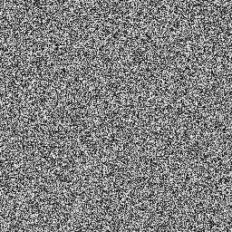
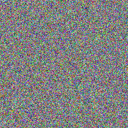

<table align="center">
  <tr>
    <td align="center">
      
      <br>
      <em>Grayscale noise</em>
    </td>
    <td align="center">
      
      <br>
      <em>RGB noise</em>
    </td>
  </tr>
</table>


# ppm rules

file must start with magic number then in next line width and height then in next line max value(usually 255). then from next line onwards RGB values for each pixel, from top row to bottom and from left to right (top left corner to bottom right corner).

eg:(p3 for decimal, p6 for binary)

```text
P3
512 512
255
1 1 1 <- pixel (1,1)
1 2 3 <- pixel (1,2)
2 4 54 <- pixel (1,3)
....
233 123 98 <- pixel (width,height)
```
# CPP Implementation:

### std::mt19937 rng(std::random_device{}()) 
- random_device{} gives a random seed from OS entropy, () calls it. mt19937 uses this as a seed. rng is the variable name.
	mt19937 produces numbers from range 0 to 2^32 -1. 
	do not try to print rng since its and object. using `operator<<` makes it to print its internal state which is 624 32-bit values. so you get a huge sequence of digits. always print rng() since calling a function will make it return a 32 bit number.


### std::uniform_int_distributon <int\> dist(0,255)
- this shapes the number in the specified range. better than using % as no. of numbers divisible isnt even which creates unfair randomness.
- uniform int distribution uses rejection sampling for better RNG. dist is used here.

### std::ofstream out("noise.ppm")
- ofstream is part of fstream. its used to write to a file, specifically out here is used to write to a file. noise.ppm is name of file.
- then we output p3 and other headers to the file acc to ppm rules.

### filling pixels
- then we open 2 nested for-loops to fill each pixel from top to bottom and left to right. we have 3 variables. each variable uses a dist(rng) to get a distinct value of R G and B and fill the pixel. 
- out is used again to output values onto file.
- also dist(rng()) does not work because we're not supposed to send a number to uniform_int_distribution, but rather we're supposed to send a random number engine or a sequence, which is what rng (not rng()) does.

### noise 
- using 3 distinct values for R,G and B produces a colourful rgb noise but using R=G=B produces a gray/tv noise. this is because if theres equal amounts of r g and b then therell be no color hue, producing a grayscale color.


